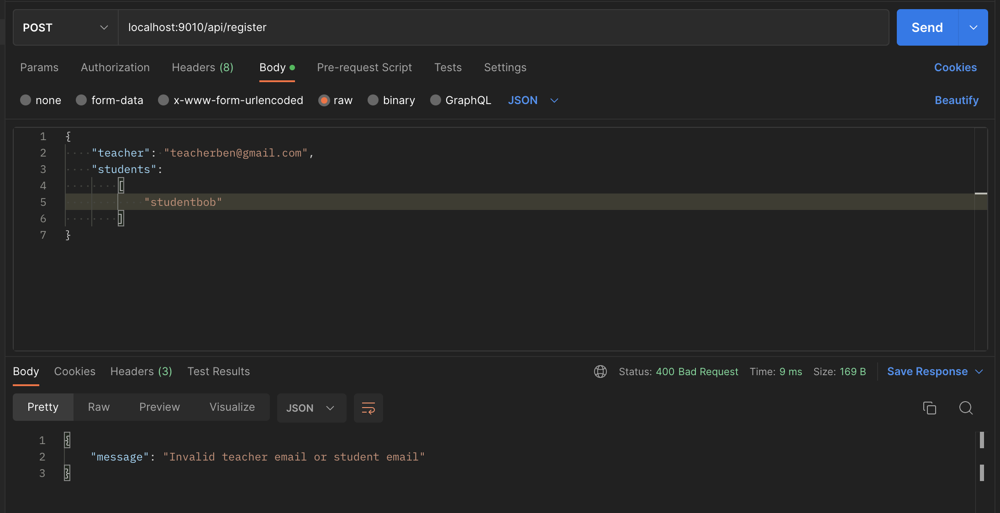

# Golang-assessment-API
Written by Koh Rui Jie

## Setup Steps / User Guide:
1. Install GO and MySQL if not already done.
2. Create a local repository by downloading this GitHub repository.
3. Install the packages used: Gorilla MUX and go-sql-driver by running  
`go get github.com/gorilla/mux`  
`go get github.com/go-sql-driver/mysql`

4. In `pkg/config/app.go`, input your local host's password in the "" in `const password = ""`

5. If there is already an existing MySQL named `testdb` in your MySQL Server, rename the database to your desired name if you do not wish to override your existing database. Rename the database in lines 21 and 26 of `app.go`

6. Change your current directory to `Golang-assessment-API-main/cmd/main/` using `cd cmd/main`, assuming you are in the `Golang-assessment-API-main` directory

7. Run `go build` to compile to program in the terminal

8. Run `go run main.go` in the terminal. Ensure you are in the `Golang-assessment-API-main/cmd/main/` directory

9. The API is now ready. To test locally, please use local host port 9010.
    - For registering students, use Request URL `localhost:9010/api/register`
    - For finding common students, use Request URL `localhost:9010/api/commonstudents?teacher=...` with the teacher's emails
    - For suspending a student, use Request URL `localhost:9010/api/suspend`
    - For finding students who can receive a notification, use Request URL `localhost:9010/api/retrievefornotifications`

10. If you would like to change the port number used, you may change it in `cmd/main/main.go`, line 16, as the first parameter of `http.ListenAndServe`.

## Testing
Unit tests are written for the `models` package (specifically `students.go`) in `models_test`, testing various valid and invalid inputs for the functions that perform SQL queries on the MySQL database.

To run tests, navigate to the `test/model` directory using `cd test/model`, then run `go test -v`

## Architecture
This API is designed similar to a MVC architecture.

**In pkg**:

`controllers` package process the requests to extract the necessary information for the queries to the database

`utils` stores functions that the controllers use to parse the request body

`models` package handles the database and the querying

`config` package connects to the database and creates the necessary tables

`routes` package handles the endpoints and calls of the API

**In cmd**:

`main` package intialises the router needed for the server to run

### Design
There exists only the `Student` table for space optimisation. There is no need for a `Teachers` table since the current requirements do not perform any queries on the teachers.

`model.go` exists to initialise the database tables, as an "overarching" file over all various entity tables. The decision to not do this within `students.go` is for scalability and proper delegation of responsibilities.

## Error handling
Any invalid syntax e.g. invalid email formats will or errors will receive a HTTP STATUS 400 (BAD REQUEST) response, with the error message in json format.

An example of an error message due to invalid student email is provided here:

